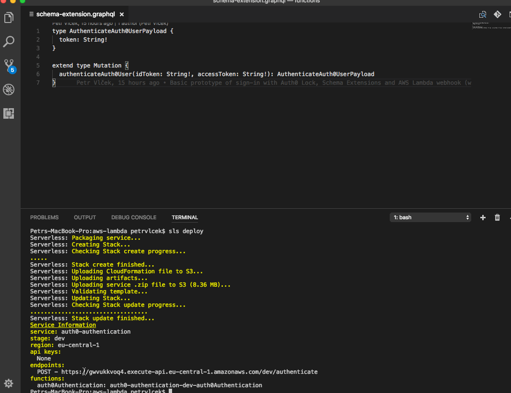

# auth0-authentication

Create users and sign in with Schema Extensions and Graphcool Functions ⚡️. 

> Note: Schema Extensions are currently only available in the Beta Program.

## Authentication flow in app

1. The user authenticates with Auth0 Lock widget with selected authentication method
2. The app receives `idToken` and `accessToken` from Auth0
4. Your app calls the Graphcool mutation `authenticateAuth0User($idToken: String!, $accessToken: String!)`
5. If no user exists yet that corresponds to the passed `idToken` and corresponding user profile, a new `User` node will be created
6. In any case, the `authenticateAuth0User($idToken: String!, $accessToken: String!)` mutation returns a valid token for the user
7. Your app stores the token and uses it in its `Authorization` header for all further requests to Graphcool

## Getting Started

* Initiate a new Graphcool project with prepared schema file
```sh
npm -g install graphcool
graphcool init --schema auth0-authentication.graphql
```
* Replace `__PROJECT_ID__` in `login-callback.html` with ID of this new project

## Setup Auth0

* Create a new Auth0 account or log-in to your existing account
* Create a new Auth0 client with following settings
  * Client Type - *Regular Web Application*
  * Token Endpoint Authentication Method - *Post*
  * Allowed Callback URLs - `http://localhost:8000/login-callback.html`
  * In Advanced Settings Section - OAuth tab set JWT Signature Algorithm to value *RS256*
  * In Advanced Settings Section - Grant Types tab leave only *Implicit* and *Password* grant types enabled
* In order to setup Auth0 Lock Widget replace `__AUTH0_CLIENT_ID__` and `__AUTH0_DOMAIN__` in `login.html`

## Setup the Authentication Function

### Variant 1: Setup the Authentication Function with AWS and Serverless

* Install Serverless framework and setup AWS account (if you don't have one). You can follow instructions in Prerequisities section in Serverless [Quick Start Guide](https://serverless.com/framework/docs/providers/aws/guide/quick-start#pre-requisites)

* Switch to the directory `functions/aws-lambda`

* Create settings for `dev` stage by copying prepared template and configure required variables (you will need Auth0 domain and client ID)
```sh
cp env-dev.yml.template env-dev.yml
```

* Build and deploy the authentication function
```sh
yarn install
sls deploy
```

* Create a new Schema Extension Function and paste the schema from `schema-extension.graphql` and paste the function URL to the input on Webhook tab



* Create a new Permanent Access Token (PAT) in project settings. There is no need to copy PAT to function's env file since Graphcool will send it with the webhook request automatically.
* Remove all Create permissions for the `User` type. The function uses PAT to create users via the API so the permissions are not needed.

### Variant 2: Setup the Authentication Function with Webtask.io
> TBD

## Run the example

To create a test Auth0 Token, run `login.html`, for example using Python's `SimpleHTTPServer`:

```sh
python -m SimpleHTTPServer
```

or for Python 3

```sh
python -m http.server 8000
```

Open `http://localhost:8000/login.html` in your browser and use the login button and authenticate with the Auth0 Lock Widget.

## Testing the Code

### Testing mutation in the Graphcool Playground
First, obtain a valid `idToken` and `accessToken` token with the small app in `login.html` as mentioned above. Both tokens are logged in JS console.

Go to the Graphcool Playground:

```sh
graphcool playground
```

Run this mutation to authenticate a user:

```graphql
mutation {
  # replace both tokens!
  authenticateAuth0User(idToken: "__ID_TOKEN__", accessToken: "__ACCESS_TOKEN__") {
    token
  }
}
```

You should see that a new user has been created. The returned token can be used to authenticate requests to your Graphcool API as that user. Note that running the mutation again with the same `idToken` will not add a new user.

### Testing the serverless function locally

* Go to the directory where `serverless.yml` is located
* Run the function locally with command
```sh
sls offline --port 3001
```
* Set up a local tunnel (this example uses [Localtunnel](https://localtunnel.github.io/www/)) and paste the public URL as a webhook URL in function settings in Graphcool Console. All requests to the function will be routed from Graphcool to your local machine
```sh
lt --port 3001
```
* Call the mutation from Graphcool Playground or authenticate from `login.html`

