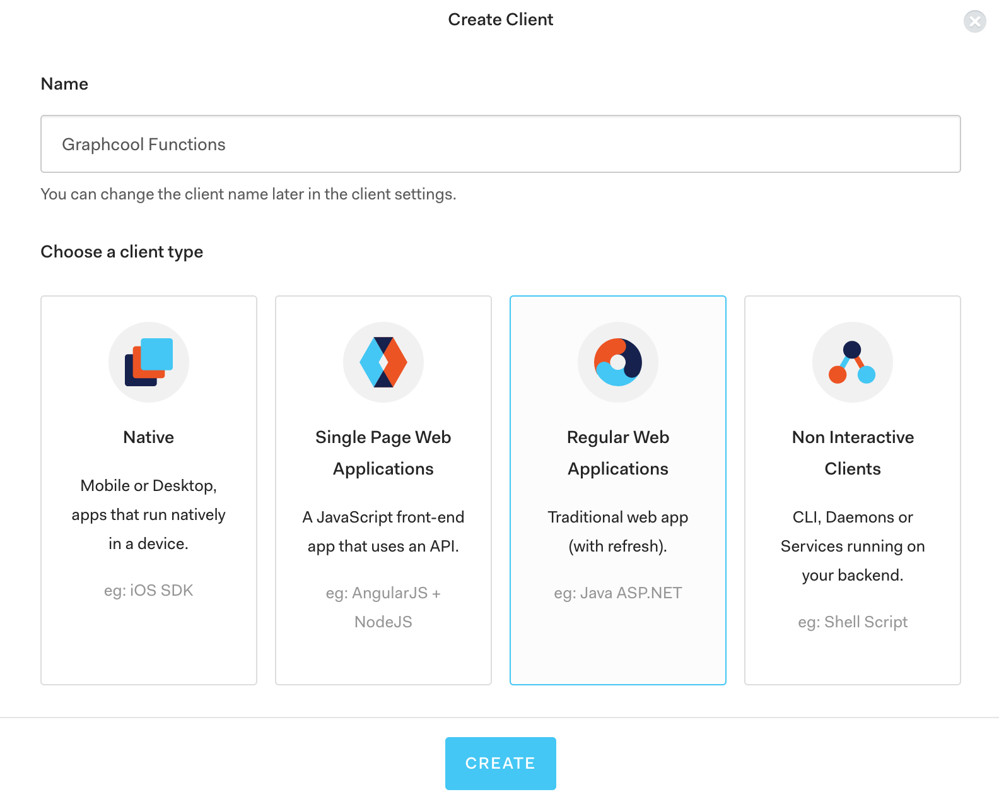
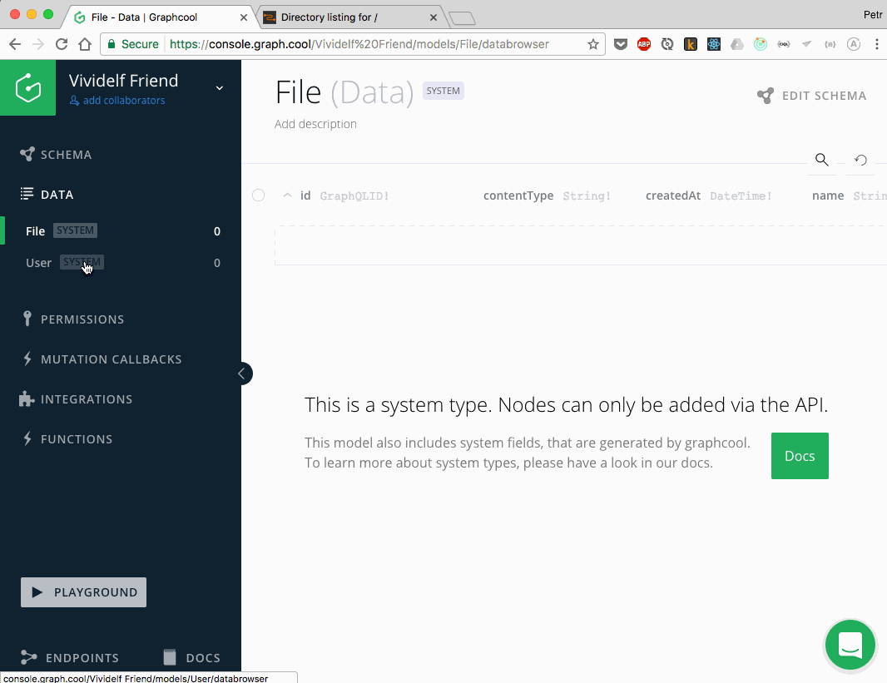

# auth0-authentication

Create Auth0 users and sign in with Schema Extensions and Graphcool Functions ⚡️

> Note: Schema Extensions are currently only available in the Beta Program.

## Authentication flow in app

1. The user authenticates with Auth0 Lock widget with selected authentication method
2. The app receives the `idToken` and `accessToken` from Auth0
4. Your app calls the Graphcool mutation `authenticateAuth0User($idToken: String!, $accessToken: String!)`
5. If no user exists yet that corresponds to the passed `idToken` and corresponding user profile, a new `User` node will be created
6. In any case, the `authenticateAuth0User($idToken: String!, $accessToken: String!)` mutation returns a valid token for the user
7. Your app stores the token and uses it in its `Authorization` header for all further requests to Graphcool

## Getting Started

* Initiate a new Graphcool project with the prepared schema file
```sh
npm -g install graphcool
graphcool init --schema auth0-authentication.graphql
```
* Replace `__PROJECT_ID__` in `login-callback.html` with ID of your new project

## Setup Auth0

* Create a new Auth0 account or log-in to your existing one
* Create a new Auth0 client with the following settings

  

  * Client Type - *Regular Web Application*
  * Token Endpoint Authentication Method - *Post*
  * Allowed Callback URLs - `http://localhost:8000/login-callback.html`

  
  * In Advanced Settings Section - OAuth tab set JWT Signature Algorithm to value *RS256*

  
  * In Advanced Settings Section - Grant Types tab leave only *Implicit* and *Password* grant types enabled

    

* In order to setup Auth0 Lock Widget replace `__DOMAIN__` and `__CLIENT_ID__` in `login.html` with the credentials from your client settings


## Setup the Authentication Function

### Variant 1: Setup the Authentication Function with AWS and Serverless

* Install Serverless framework and setup AWS account (if you don't have one). You can follow instructions in Prerequisities section in Serverless [Quick Start Guide](https://serverless.com/framework/docs/providers/aws/guide/quick-start#pre-requisites)

* Switch to the directory `functions/aws-lambda`

* Create the settings for the `dev` stage by copying prepared template and configuring the required variables (you will need to set the Auth0 domain and client ID from above)
```sh
cp env-dev.yml.template env-dev.yml
```

* Build and deploy the authentication function
```sh
yarn install
sls deploy
```
* Copy the function URL from your console and continue with setting up a Schema Extension in Graphcool Console

### Variant 2: Setup the Authentication Function with Webtask.io

* Install and initialize [Webtask CLI](https://webtask.io/docs/wt-cli)

  ```sh
  npm install wt-cli -g

  wt init your@email.com
  ```
* Switch to directory `functions/webtask`
* Add your webtask secrets to file  `auth0-authentication.js.secrets` (you will need to set the Auth0 domain and client ID from above)
* Deploy prepared webtask script along with secrets file, information will be encrypted on server.

  ```sh
  wt create auth0-authentication.js --secrets-file auth0-authentication.js.secrets
  ```
* The script depends on an external module, `graphcool-lib`. To make this dependency available to the Webtask, `wt-cli` will look for a `package.json` in the folder, and automatically adds all dependencies from it to your Webtask container. For more information, see the Webtask documentation on [modules]( https://webtask.io/docs/modules). You will see the following output:
  ```sh
  * Hint: A package.json file has been detected adjacent to your webtask. Ensuring that all dependencies from that file are avialable on the platform. This may take a few minutes for new versions of modules so please be patient.
  * Hint: If you would like to opt-out from this behaviour, pass in the --ignore-package-json flag.
  Resolving 1 module...
  Provisioning 1 module...
  graphcool-lib@0.0.3 is available
  Webtask created

  You can access your webtask at the following url:

  https://__YOUR_WEBTASK_URL__```
* Note the webtask URL from the console. The webtask uses an embedded express server, that listens at the `/authenticate` path, so  use `https://__YOUR_WEBTASK_URL__/authenticate` as Webhook URL in the next step.
* Continue with setting up a Schema Extension in Graphcool Console

## Set up Schema Extension in Graphcool console
* Create a new Schema Extension Function and paste the schema from `schema-extension.graphql`. Then set the function URL as the Webhook URL.


* Create a new Permanent Access Token (PAT) in project settings. *It needs to have the same name as the function to make it available in the execution context of the function.*
* Remove all Create permissions for the `User` type. The function uses the PAT to create users via the API so the permissions are not needed.

## Run the example

To create a test Auth0 Token, run `login.html`, for example using Python's `SimpleHTTPServer`:

```sh
python -m SimpleHTTPServer
```

or for Python 3

```sh
python -m http.server 8000
```

Open `http://localhost:8000/login.html` in your browser and use the login button and authenticate with the Auth0 Lock Widget.



## Testing the Code

### Testing mutation in the Graphcool Playground
First, obtain a valid `idToken` and `accessToken` token with the small app in `login.html` as mentioned above. Both tokens are logged in JS console.

Go to the Graphcool Playground:

```sh
graphcool playground
```

Run this mutation to authenticate a user:

```graphql
mutation {
  # replace both tokens!
  authenticateAuth0User(idToken: "__ID_TOKEN__", accessToken: "__ACCESS_TOKEN__") {
    token
  }
}
```

You should see that a new user has been created. The returned token can be used to authenticate requests to your Graphcool API as that user. Note that running the mutation again with the same `idToken` will not add a new user.

### Testing the serverless function locally

* Go to the directory where `serverless.yml` is located
* Run the function locally with command
```sh
sls offline --port 3001
```
* Set up a local tunnel (this example uses [Localtunnel](https://localtunnel.github.io/www/)) and paste the public URL as a webhook URL in function settings in Graphcool Console. All requests to the function will be routed from Graphcool to your local machine
```sh
lt --port 3001
```
* Call the mutation from Graphcool Playground or authenticate from `login.html`

## Contributions

Thanks so much [@petrvlcek](https://github.com/petrvlcek) for contributing this example! 🎉
