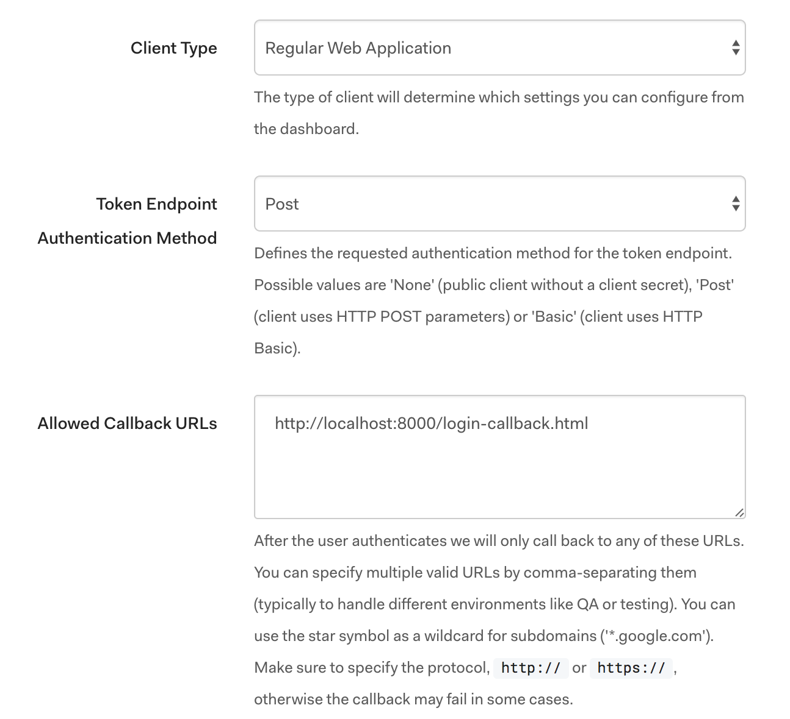
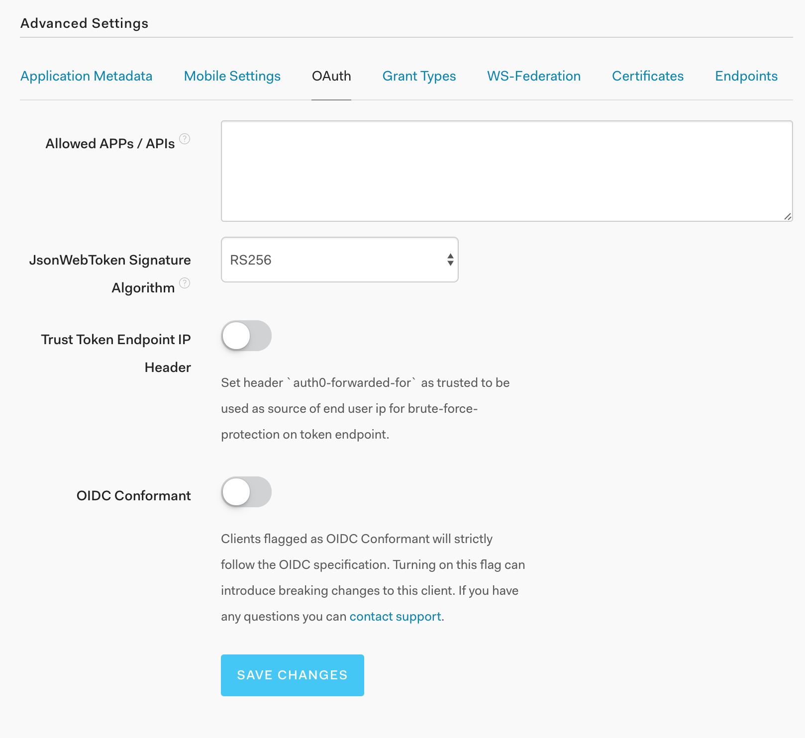
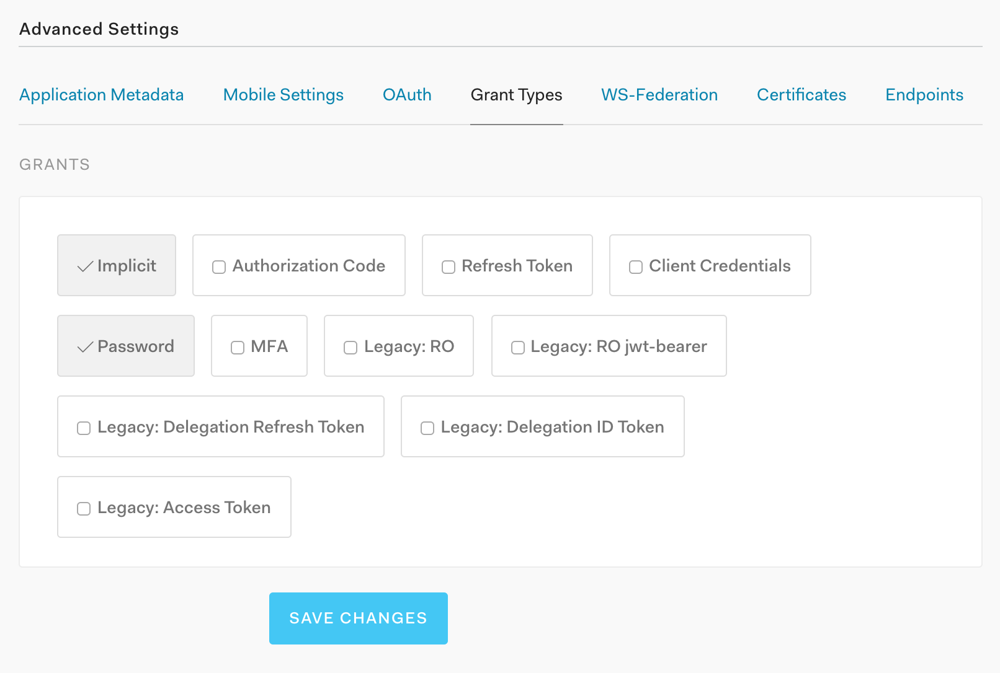
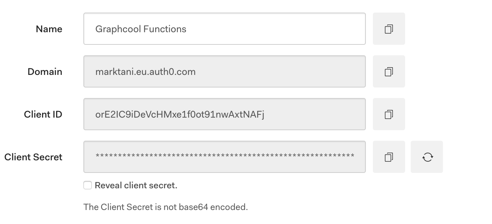

# auth0-rule-authentication

This authentication examples uses Auth0, and retrieves the Graphcool token as part of the Auth0 authentication process using Auth0 Rules. The Graphcool token is added as claim to the payload of the id_token received from Auth0.
This example does not require any Schema Extensions on the Graphcool side! Also, no Auth0 token exchange is needed between Auth0 and Graphcool.
This examples supports the default Auth0 client settings (RS256 and OIDC conformant)

## Authentication flow in app

1. The user authenticates with Auth0 Lock widget with selected authentication method
2. Auth0 runs the defined Rule as part of the authentication process
3. The Rule function checks if a Graphcool user exists based on the Auth0 id, and creates the user if not found
4. The Rule function generates the Graphcool token, and adds it as claim to the Auth0 id_token
5. Your app receives the `idToken` from Auth0
6. Your app decodes the token to retrieve the Graphcool token
7. Your app stores the token and uses it in its `Authorization` header for all further requests to Graphcool

## Getting Started

* Initiate a new Graphcool project with the prepared schema file
```sh
npm -g install graphcool
graphcool init --schema auth0-rule-authentication.graphql
```

## Setup Auth0 Client

* Create a new Auth0 account or log-in to your existing one
* Create a new Auth0 client with the following settings

  

  * Client Type - *Regular Web Application*
  * Token Endpoint Authentication Method - *Post*
  * Allowed Callback URLs - `http://localhost:8000/login-callback.html`

  
  * In Advanced Settings Section - OAuth tab set JWT Signature Algorithm to value *RS256*

  
  * In Advanced Settings Section - Grant Types tab leave only *Implicit* and *Password* grant types enabled

    

* In Advanced Settings Section - Application Metadata tab, add the following key-value pairs:
  * `GRAPHCOOL_PROJECTID` with your Graphcool project id

  * `GRAPHCOOL_PAT1`, `GRAPHCOOL_PAT2`, `GRAPHCOOL_PAT3` with the three parts of a Graphcool PAT. This is due to a length restriction for metadata on Auth0.

* In order to setup Auth0 Lock Widget replace `__DOMAIN__` and `__CLIENT_ID__` in `login.html` with the credentials from your client settings



* In the Auth0 dashboard under 'Rules', create a new Rule. Use the code from `auth0-rule.js`. Ignore all code warnings when saving. These are due to the limited editor support on Auth0 Rules.

## Run the example

To create a test Auth0 Token, run `login.html`, for example using Python's `SimpleHTTPServer`:

```sh
python -m SimpleHTTPServer
```

or for Python 3

```sh
python -m http.server 8000
```

Open `http://localhost:8000/login.html` in your browser and use the login button and authenticate with the Auth0 Lock Widget.

Open the console window to see your Graphcool token. You can check your newly created user in the Playground.
