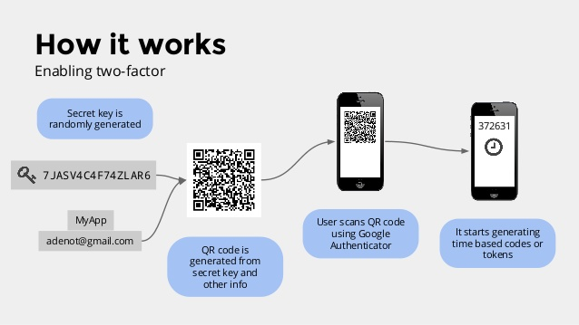
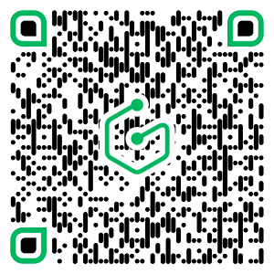

# Google Authenticator Authentication

This is an example of Time-based One-Time Password (TOTP) authentication, compatible with Google Authenticator and other Authenticator apps (like Microsoft Authenticator), and hardware authenticator tokens. It is a form of two factor authentication (2FA). Although the example uses basic email-password authentication, the example can easily be applied to other authentication providers too.



## Registration and Authentication

### Registration Flow

- User registers using email and password
- User registers for OTP authentication
- User activates OTP authentication by entering an OTP token from their Authenticator

### Authentication Flow

- User signs in using email and password
- If OTP is not activated for the user, a token is returned
- If OTP is activated, a preAuthentication response is returned
- The client can ask the user for an OTP token
- The OTP token is validated and a token is returned

## Setting up the project

### Schema

Use the `graphcool-cli` to create a new Graphcool project, based on the schema, and open the Console:
```bash
graphcool init --schema ./schema.graphql
graphcool console
```
### Permissions

> **Warning! I have not configured permissions for this example. You need to configure protection for sensitive fields from the `User` Type yourself!**

### Permanent Authentication token

Create a new Permanent Authentication Token on the 'Authentication' tab of the 'Project Settings' page.
The PAT needs to be named 'authenticateUser'. This PAT will be used by the schema extension mutation.

### Webtask

The functionality for this example is implemented in an external webtask. The are two reasons for doing this:
- The webtask contains some helper functions that would need to be duplicated when using inline schema extension functions.

- Creating the schema extensions is actually optional. All functionality can also be used by directly accessing the webtask routes. The only change necessary would be hardcoding your projectId and PAT in the `authenticateUser` route.

Deploy the webtask using `wt-cli`:
```sh
wt create otp-authentication.js
```
The `wt-cli` will deploy the webtask, and install all dependencies defined in `package.json`. Note the URL of your deployed webtask. You will need this to set up the schema extensions.

### Schema extensions

Create the following Schema Extensions:

| Name | SDL | Webhook URL | Headers |
| ---- | --- | ------- | ------- |
| registerOTP |  [registerOTP.graphql](./extensions/registerOTP.graphql) | https://__WEBTASK_URL__/registerOtp | X-OTP-Issuer: Your Company Name |
| initializeOTP |[initializeOTP.graphql](./extensions/initializeOTP.graphql) | https://__WEBTASK_URL__/initializeOtp |
| registerUser |[registerUser.graphql](./extensions/registerUser.graphql) | https://__WEBTASK_URL__/registerUser |
| authenticateUser | [authenticateUser.graphql](./extensions/authenticateUser.graphql) | https://__WEBTASK_URL__/authenticateUser |

## Running the example

### User Registration

To register a new user, use the following mutation:

```graphql
mutation {
  registerUser(email: "__EMAIL__", password: "__PASSWORD__") {
    id
  }
}
```

### Activating OTP

To register a user for OTP, select the user you just registered in the Playground and use the following mutation:

```graphql
mutation {
  registerOTP {
    secret
    qrUrl
  }
}
```

This mutation will generate an OTP secret for the user, and it will generate and upload a QR Code image that the user can scan using the Google Authenticator app. If you open the qrUrl in your browser, you'll see the QR code. This can also be easily embedded into your client app. The secret is also presented in a human readable form. It is adviced to show this secret to the user for manual entry into the Authenticator app.
Optionally, if you want to use a hardware token, you can also pass the OTP secret for the device to the mutation.



After a user registers for OTP, a one time token from the Authenticator app is required to verify the installation, and activate OTP for the user. Again, select the registered user in the Playground first.

```graphql
mutation {
  initializeOTP(code: "__TOKEN__") {
    success
  }
}
```

If the verification of the token is successful, OTP is activated.

### Authentication

The `authenticateUser` mutation is used to authenticate the user. It offers a two-step authentication, based on your desired client flow.

#### Pre-authentication

If not of all of your users have OTP activated, you might want to login first using username and password, and ask for a token if OTP is activated for the user. To use this flow, first call the following mutation:

```graphql
mutation {
  authenticateUser(email: "__EMAIL__", password: "__PASSWORD__") {
    preAuthenticated
    token
  }
}
```

The system will verify the user credentials. If OTP is not activated, a token is returned right away. If OTP is activated for the user, the above mutation will not return a token, and will return `preAuthenticated: true` to indicate that OTP is required to authenticate.

To provide this token, call the following mutation:

```graphql
mutation {
  authenticateUser(email: "__EMAIL__", password: "__PASSWORD__", code: "__TOKEN__") {
    token
  }
}
```

The system will verify the OTP token, and return the authentication token.

## Contributions

Thanks so much [@kbrandwijk](https://github.com/kbrandwijk) for contributing this example! :tada:
