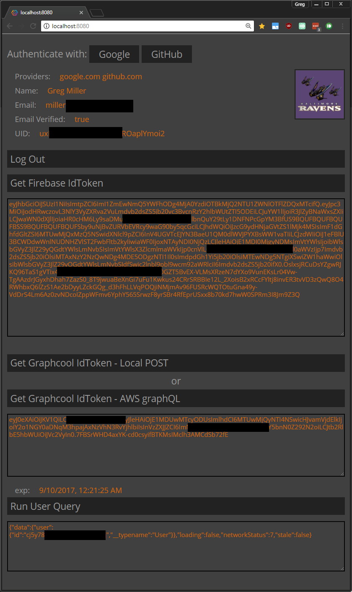

# firebase-authentication

Create Firebase users and sign in with Schema Extensions and Graphcool Functions

## Project Setup

This example uses Amazon Web Services Lambda and API Gateway.  The function's handler is specific to Lambda events but could be easily changed for use with another provider.

### Graphcool Setup 1

- Create a new Permanent Access Token (PAT) in project settings.
- Remove all Create permissions for the `User` type. The function created below uses a PAT to create users via the API so the permissions are not needed.


### Firebase Setup

Create a Firebase project:
- <https://console.firebase.google.com/u/1/>

Copy your Firebase project's web sdk api keys:
- <https://firebase.google.com/docs/web/setup>

Create a Firebase Service Account :
- <https://console.cloud.google.com/projectselector/iam-admin/serviceaccounts>
- Download the provided private key

Configure Sign-In Methods for your Firebase project
- https://console.firebase.google.com
- Follow instructions or each social authentication provider you enable
- The example app uses Google and Github for demonstration

### AWS Setup

Sign up for Amazon Web Services
- [aws.amazon.com](http://aws.amazon.com)

Create a user for your Lambda function
- <http://docs.aws.amazon.com/IAM/latest/UserGuide/id_users_create.html>
- **NOTE** Assign limited permissions to this user for a production environment

Generate AWS Access Credentials for that user
- <http://docs.aws.amazon.com/IAM/latest/UserGuide/id_credentials_access-keys.html> 


### Serverless Setup

Install the serverless CLI
```
yarn global add serverless
```
Configure your AWS Access Credentials
- https://serverless.com/framework/docs/providers/aws/guide/credentials/

Edit the env-**_stage_**.yml file
- (remove .EXAMPLE)
- Insert the Graphcool PAT and ProjectId
- Insert the Firebase Service Account private key file's contents

Edit the package.json file
- Change the "deploy-dev" script to your correct AWS region

Install dependencies
```
yarn
```

Run the function locally, using serverless-offline:
```
yarn run debug
```
Deploy to AWS:
```
yarn run build
yarn run deploy-dev
```
- Make note of the endpoint created

### Graphcool Setup 2

Create a new Schema Extension Function
- Paste the schema from `schema-extension.graphql`
- Enter your AWS Lambda endpoint for the Webhook url


### Example App Setup

Edit examples/one-page/index.js
- Insert your Firebase web sdk apiKey and authDomain
- Insert your AWS Lambda endpoint
- Insert your Graphcool project endpoint

Install dependencies
```
cd examples/one-page
yarn
```
Start local server
```
yarn run start
```
Point your browser to <http://localhost:8080>

## Authentication flow in the example app

1. Click the `Authenticate with ( Google | Github )` button
1. The selected provider requests login and access permissions
1. A Firebase user is registered
1. Click the "Get Firebase IdToken" button
1. A Firebase Id Token is provided
    1.  Click the "Get Graphcool IdToken = Local POST"
        1. A Graphcool Id Token in provided using a local mock serverless debug instance
    1. Click the "Get Graphcool IdToken - AWS graphQL" button
        1. Your app calls the Graphcool mutation `authenticateFirebaseUser(firebaseIdToken: String!)`
1. Note that using another provider while already authenticated will link each subsequent social account
1. If no user exists yet that corresponds to the passed `firebaseIdToken`, a new `User` node will be created
1. The Graphcool Id token can be used to authenticate further requests to Graphcool by inserting it in each http request's `authorization` header



- The tokens displayed by the example app can be decoded online at [jwt.io](http://jwt.io).
- The tokens can be edited, invalidating them, to simulate a bad token.


## Real Application

### Graphcool Mutation
This mutation will authenticate a user:

```graphql
mutation {
  # replace __FIREBASE_TOKEN__!
  authenticateFirebaseUser(firebaseIdToken: "__FIREBASE_TOKEN__") {
    wrappedToken
  }
}
```

You should see that a new user has been created. The returned object (wrappedToken) contains a token (token) which can be used to authenticate requests to your Graphcool API as that user.  The expiration date (exp), and user Ids (firebaseUserId, graphcoolUserId) are also included.  These are included for convenience; your authentication process should not rely on the accuracy of these values.  Meaning: it's safe to fail authentication if these values are not as expected, but not safe to consider a successful authentication; only the token can do that.  
Note that running the mutation again for the same Firebase user will simply return a new token for the existing Graphcool user.

### Token management
The Firebase web sdk keeps a user signed in indefinitely by default.  But only signed in to Firebase.  Firebase will provide a valid Id Token any time an app calls `auth().currentUser.getIdToken()`.

The Graphcool token must be managed by a production application, especially regarding expiration.  At the time this was written, Graphcool Id Tokens are valid for one month.

## Contributions

Thanks so much [@Gregor1971](https://github.com/Gregor1971) and [@jhalborg](https://github.com/jhalborg) for contributing this example :tada:


